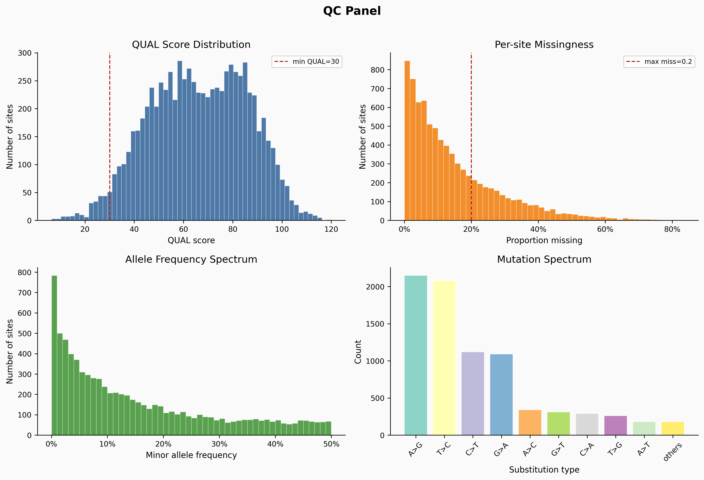
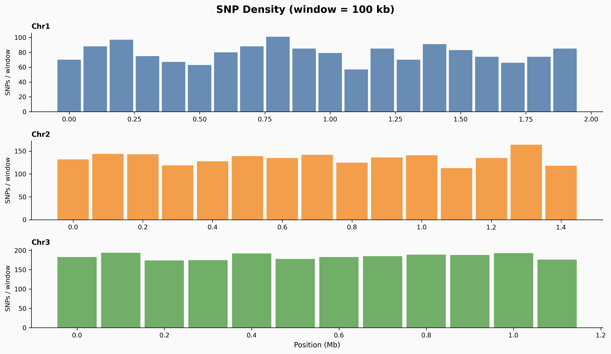
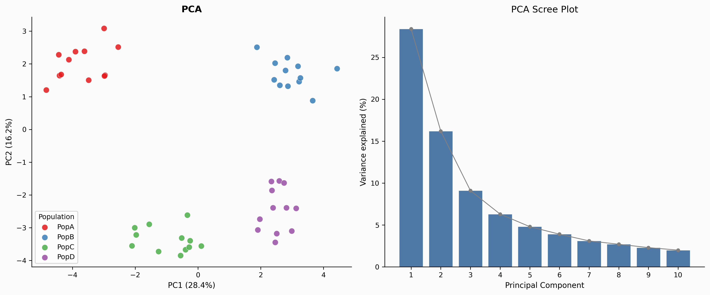
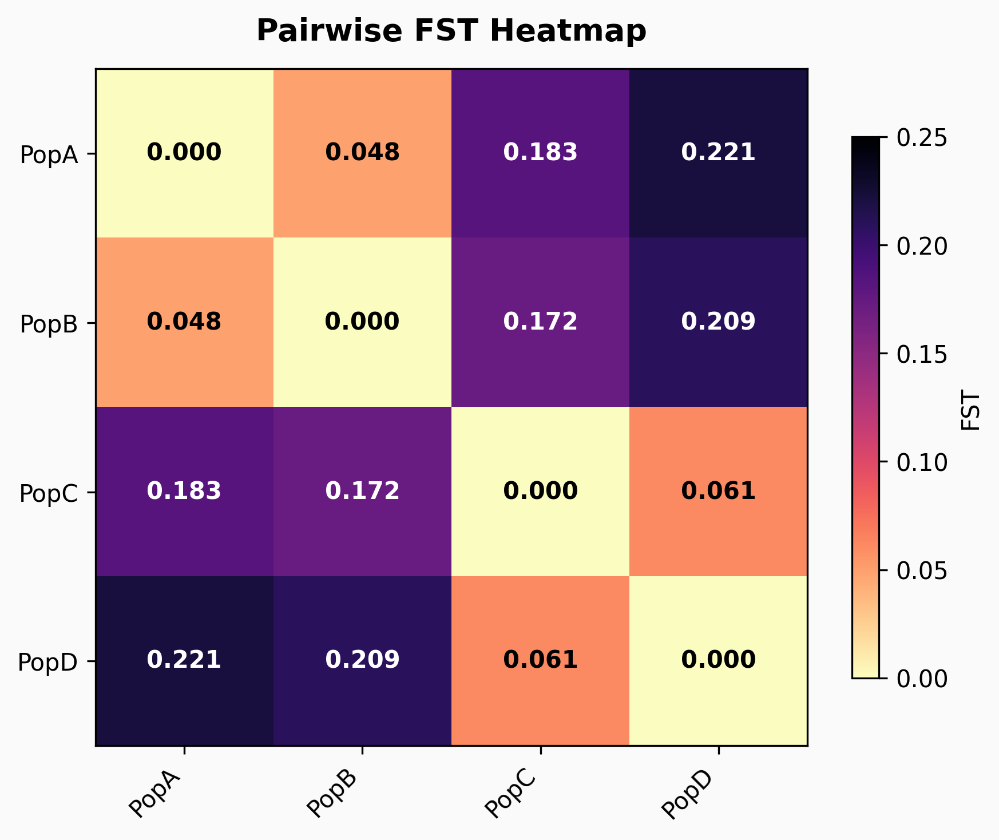
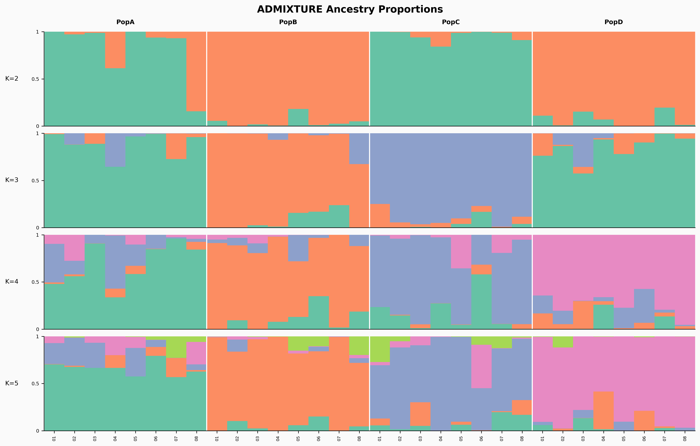
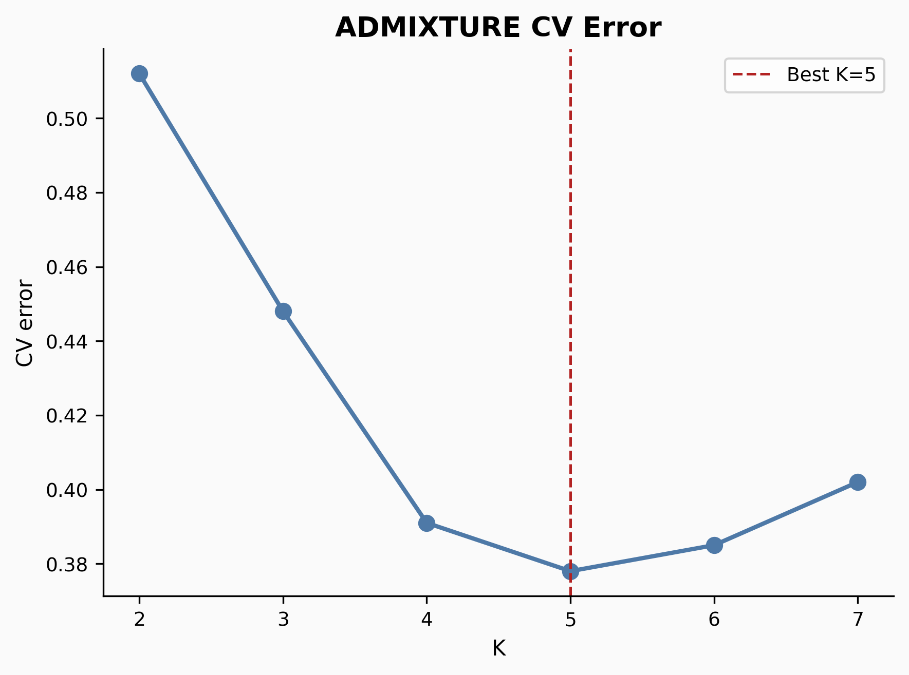
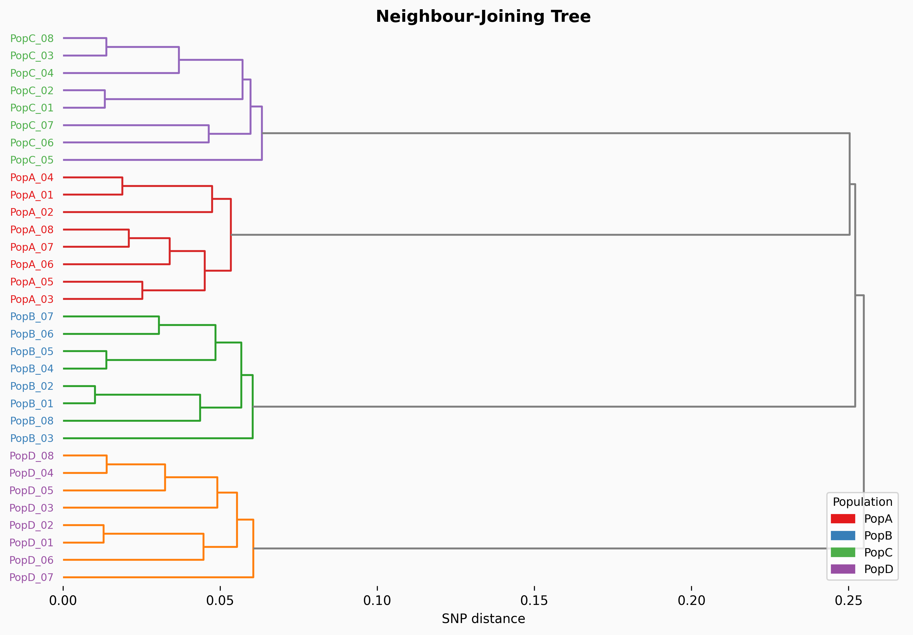
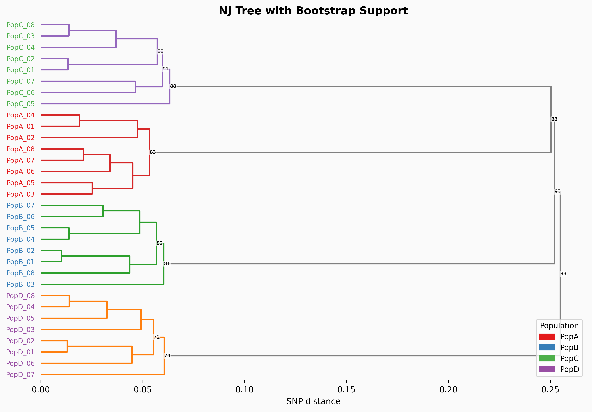
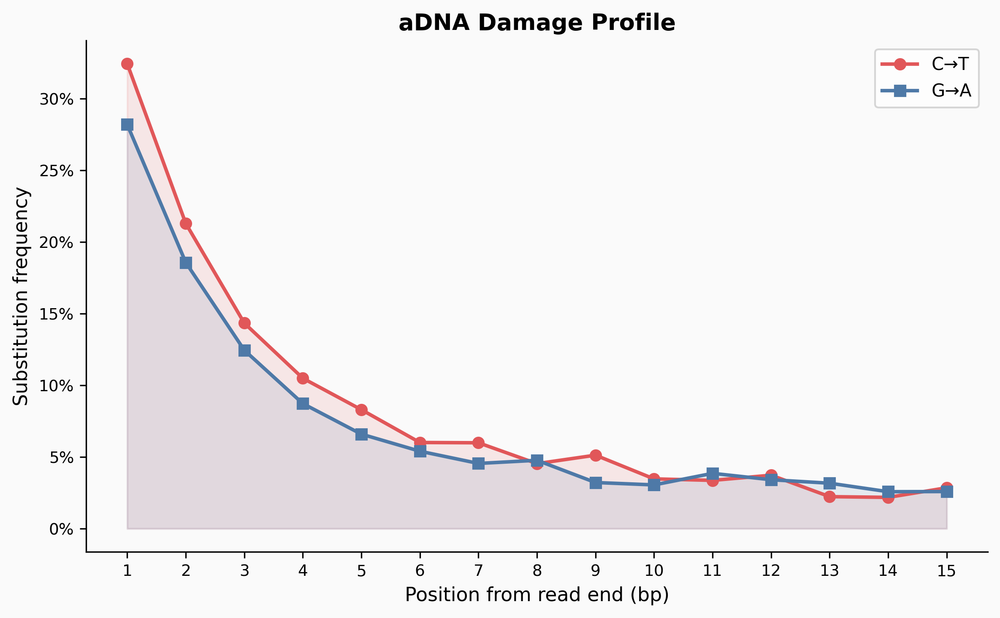

# Genomic Sequence Variation Analysis — R Pipeline

[](https://www.r-project.org/)
[](https://bioconductor.org/)
[](#domain-specific-settings)
[](#outputs)
[](LICENSE)
[]()
[]()

---

## Biological Question

How does genetic variation differ across individuals and populations — and what can those differences tell us about population structure, ancestry, evolutionary history, and ancient demographic events?

Every organism's genome carries a record of its evolutionary past encoded in single nucleotide polymorphisms (SNPs): positions in the genome where individuals differ by a single base. These variants accumulate through mutation, drift, selection, and gene flow, and their patterns across individuals and populations are the raw material of population genetics. By systematically characterising SNP variation — filtering for quality, summarising allele frequencies, quantifying differentiation between groups, and inferring phylogenetic relationships — we can reconstruct demographic histories, identify population structure, detect signals of admixture, and place ancient samples in a modern genomic context.

This pipeline addresses those questions using multi-sample VCF files as input. It is designed to work with two distinct genomic domains:

- **Bacterial genomics:** high-quality SNP filtering, population differentiation (FST), PCA, and phylogenetics applied to prokaryotic datasets where recombination, short generation times, and clonal structure shape variation differently from eukaryotes.
- **Ancient human DNA (aDNA):** specialised handling of the damage patterns, low coverage, and missingness inherent to ancient samples — including pseudo-haploid calling, C>T/G>A deamination reporting, and mapDamage2 integration — alongside the same population genetics and phylogenetic methods used for modern samples.

The pipeline produces publication-quality figures and structured output files covering the full workflow from raw VCF to annotated phylogenetic trees.

---

## Key Outputs at a Glance

| Analysis | Output file | What it answers |
|----------|------------|-----------------|
| QC filtering | `output/filtered.vcf.gz` | Which variants pass quality thresholds? |
| Site statistics | `output/site_stats.csv` | What are the per-site depth, missingness, and allele frequency distributions? |
| PCA | `output/pca_scores.csv` + `figures/03_pca.png` | Do individuals cluster by population? How much variance does each PC explain? |
| FST | `output/fst_matrix.csv` + `figures/04_fst_heatmap.png` | How genetically differentiated are the populations from one another? |
| ADMIXTURE | `figures/05_admixture_barplot.png` | What proportion of each individual's ancestry derives from each inferred source population? What is the optimal number of ancestral components K? |
| Phylogenetics | `output/nj_tree.nwk` + `figures/06_nj_tree.png` | What are the evolutionary relationships among individuals? Which branching patterns are robustly supported? |
| aDNA damage | `figures/07_adna_damage.png` | Does the C>T/G>A substitution frequency at read termini confirm authentic ancient DNA damage? |

---

## Scientific Background

### SNP variation and its causes

A SNP arises when a mutation at a single genomic position becomes fixed or polymorphic in a population. The frequency of a SNP in a population is shaped by genetic drift (random fluctuation in small populations), natural selection (advantageous or deleterious variants change in frequency directionally), mutation rate, and gene flow between populations. Comparing SNP frequencies across populations therefore encodes information about all of these forces simultaneously.

### Principal Component Analysis (PCA)

PCA rotates the high-dimensional genotype matrix (individuals × SNPs) to find the axes of greatest variation. The first few principal components typically capture population structure: individuals from the same population cluster together because they share more alleles with each other than with individuals from other populations. PC1 and PC2 usually explain the largest fraction of variance and are plotted as a scatter; the scree plot quantifies how much of the total variance each subsequent component captures.

LD pruning is applied before PCA to remove correlated SNPs that would otherwise inflate the variance explained by genomic regions with high linkage disequilibrium, ensuring that PCs reflect genome-wide structure rather than local haplotype blocks.

### FST — fixation index

FST measures the proportion of total genetic variation that is explained by differences *between* populations rather than within them. It ranges from 0 (populations are indistinguishable) to 1 (populations are completely differentiated and share no alleles). Here, pairwise Weir & Cockerham FST is computed between every pair of populations and displayed as a heatmap: high values indicate strong differentiation, low values indicate substantial shared variation.

As a rough guide: FST < 0.05 is considered slight differentiation, 0.05–0.15 moderate, 0.15–0.25 great, and > 0.25 very great differentiation.

### ADMIXTURE analysis

ADMIXTURE models each individual's genotype as a mixture of K ancestral populations, estimating the proportion of ancestry derived from each. Running the analysis for multiple values of K and choosing the K with the lowest cross-validation (CV) error gives the best-supported number of ancestral components. The barplot shows each individual as a vertical bar, coloured proportionally by ancestry component — populations with shared ancestry appear as similar mixtures; isolated populations appear as single solid colours.

ADMIXTURE must be run externally on the filtered VCF before the pipeline can parse its outputs (see [Notes](#notes)).

### Neighbour-joining phylogenetics

The neighbour-joining (NJ) algorithm constructs a phylogenetic tree from a pairwise SNP distance matrix by iteratively joining the pair of taxa whose joining minimises the total branch length. It is computationally efficient and parameter-free, making it well-suited for exploratory phylogenetics on large SNP datasets. Bootstrap resampling assesses how consistently each internal branch is supported across resampled datasets: values ≥ 70% are conventionally considered reliable.

### Ancient DNA considerations

Ancient DNA is chemically degraded: cytosine residues at the ends of DNA fragments spontaneously deaminate to uracil over time, which is read as thymine during sequencing. This produces a characteristic C>T excess at the 5′ end and G>A excess at the 3′ end of reads — the aDNA damage profile. Confirming this profile is a key authenticity check. Because ancient samples are typically low-coverage with high missingness, less stringent quality filters are applied (`min_dp = 3`, `max_miss = 0.5`), and pseudo-haploid calling (randomly sampling one allele at heterozygous positions) is used before PCA and ADMIXTURE to avoid artefacts from treating low-coverage diploid genotypes as reliable.

---

## Repository Structure

```
project/
├── 01_vcf_snp_analysis.R       # VCF loading, SNP filtering, site statistics
├── 02_population_genetics.R    # PCA, FST, ADMIXTURE parsing
├── 03_phylogenetics.R          # Tree construction, annotation, plotting
├── 04_visualisation.R          # All ggplot2 figure functions
├── 05_master_pipeline.R        # End-to-end orchestration — start here
├── data/
│   ├── raw_variants.vcf.gz     # Indexed, bgzipped multi-sample VCF (input)
│   ├── raw_variants.vcf.gz.tbi # Tabix index
│   ├── sample_metadata.csv     # ind_id, population, country, year
│   └── damage_profile.csv      # mapDamage2 output (aDNA only)
├── admixture/
│   ├── out.2.Q / out.3.Q ...   # ADMIXTURE Q-matrix files, one per K
│   └── logs/
│       ├── k2.log / k3.log ... # ADMIXTURE log files with CV error lines
├── figures/                    # Created automatically — PNG outputs (300 dpi)
└── output/                     # Created automatically — filtered VCF and CSVs
```

---

## Requirements

### R version

R ≥ 4.2.0

### CRAN packages

```r
install.packages(c(
  "vcfR", "tidyverse", "data.table", "ape", "phangorn",
  "adegenet", "hierfstat", "ggtree", "treeio", "patchwork",
  "viridis", "RColorBrewer", "ggrepel", "ggridges", "scales", "purrr"
))
```

### Bioconductor packages

```r
if (!requireNamespace("BiocManager", quietly = TRUE))
  install.packages("BiocManager")
BiocManager::install(c("VariantAnnotation", "GenomicRanges"))
```

### External tools (optional but required for specific steps)

| Tool | Required for | Link |
|------|-------------|------|
| [mapDamage2](https://ginolhac.github.io/mapDamage/) | `plot_adna_damage()` — aDNA damage profile figure | Run externally; output CSV provided to pipeline |
| [ADMIXTURE](https://dalexander.github.io/admixture/) | Steps 5–6 — ancestry proportion and CV error plots | Run externally on filtered VCF; `.Q` and `.log` files parsed by pipeline |
| [IQ-TREE2](http://www.iqtree.org/) / [FastTree](http://www.microbesonline.org/fasttree/) / [BEAST2](https://www.beast2.org/) | Optional — maximum-likelihood or Bayesian trees | Tree files imported via `read_iqtree()` / `read_newick()` / `read_beast()` |

---

## Input Data

| File | Description |
|------|-------------|
| `data/raw_variants.vcf.gz` | Indexed, bgzipped VCF (multi-sample). Must be produced by a variant caller such as GATK HaplotypeCaller or FreeBayes. |
| `data/sample_metadata.csv` | Sample metadata — must include `ind_id` and `population` columns. Additional columns (country, year, etc.) are carried through for annotation. |
| `data/damage_profile.csv` | mapDamage2 misincorporation output (aDNA only). Must contain `pos`, `CtoT`, and `GtoA` columns. |
| `admixture/*.Q` | ADMIXTURE Q-matrix files, one per K value. Filename must end in `.<K>.Q` (e.g. `out.3.Q`). |
| `admixture/logs/k*.log` | ADMIXTURE log files. Must contain lines of the form `CV error (K=N): X.XXXX`. |

### Metadata format (`sample_metadata.csv`)

```
ind_id,population,country,year
SampleA,PopA,Germany,1200
SampleB,PopA,Germany,1350
SampleC,PopB,France,800
```

---

## Quick Start

Open `05_master_pipeline.R` and edit the `CONFIG` block at the top:

```r
CONFIG <- list(
  vcf_path     = "data/raw_variants.vcf.gz",
  metadata     = "data/sample_metadata.csv",
  domain       = "bacterial",   # or "adna"
  outgroup     = NULL,          # sample ID to root the tree, or NULL

  # SNP filters
  min_qual     = 30,
  min_dp       = 5,
  max_miss     = 0.2,
  min_maf      = 0.01,
  remove_ct_ga = FALSE,   # aDNA: set TRUE to remove deamination-prone sites

  # PCA
  pca_n_comp   = 10,
  ld_window    = 50,
  ld_r2        = 0.2,

  # ADMIXTURE
  admixture_k       = 2:5,
  admixture_q_dir   = "admixture/",
  admixture_log_dir = "admixture/logs/",

  # Phylogenetics
  n_bootstrap  = 100,
  bs_threshold = 70
)
```

Then source the script:

```r
source("05_master_pipeline.R")
```

---

## Domain-Specific Settings

### Bacterial genomics (default)

```r
domain       = "bacterial"
min_qual     = 30
min_dp       = 5
max_miss     = 0.2
min_maf      = 0.01
remove_ct_ga = FALSE
```

Standard thresholds suited to high-coverage, high-quality short-read bacterial sequencing. Biallelic SNPs passing all filters are retained for downstream analysis.

### Ancient DNA

```r
domain       = "adna"
min_dp       = 3       # lower — coverage is typically sparse
max_miss     = 0.5     # more permissive — many sites will be partially missing
min_maf      = 0       # no MAF filter — pseudo-haploid calling
remove_ct_ga = FALSE   # set TRUE to exclude deamination-prone C>T / G>A sites
```

When `domain = "adna"` the pipeline automatically:
- Applies `filter_adna()` instead of `filter_snps()`, with more permissive depth and missingness thresholds appropriate for ancient samples
- Reports the count of C>T and G>A transitions detected, which should be elevated in authentic ancient DNA
- Applies pseudo-haploid conversion before PCA (randomly sampling one allele at heterozygous positions to avoid artefacts from low-coverage diploid calls)
- Generates the aDNA damage profile figure if `data/damage_profile.csv` is present

Setting `remove_ct_ga = TRUE` excludes C>T and G>A sites before population genetics analyses, removing the most damage-prone positions to reduce their influence on downstream statistics. This is conservative and reduces SNP count but improves the reliability of FST, PCA, and phylogenetic inference in heavily damaged datasets.

---

## Outputs & Interpretation

### Figures (`figures/`)

All figures are saved as `.png` at 300 dpi.

---

#### Figure 1 — QC Panel



A four-panel quality control summary computed from the raw filtered VCF.

- **QUAL score distribution (top left):** The QUAL field from the VCF encodes the Phred-scaled confidence that a variant exists at that site. The dashed line marks the `min_qual` threshold; variants to the left are excluded. A well-behaved distribution peaks well above the threshold, indicating that most variants are high-confidence calls. A large spike at low QUAL values would suggest a noisy dataset or poor variant calling.
- **Per-site missingness (top right):** The proportion of samples with missing genotype calls at each site. High-missingness sites are excluded by `max_miss`. Excess missingness can indicate a problematic genomic region (e.g. repetitive sequence, mapping artefact) or a subset of samples with low coverage. In aDNA datasets a more permissive threshold is used given the inherently sparse coverage.
- **Allele frequency spectrum (bottom left):** The distribution of minor allele frequencies (MAF) across retained SNPs. A classic AFS has a large excess of rare variants (low MAF) that decreases toward the common-variant tail — this reflects the demographic history of the population and the action of purifying selection on deleterious variants. A flat or U-shaped AFS may indicate sequencing errors inflating rare-variant counts, or strong balancing selection maintaining intermediate-frequency variants.
- **Mutation spectrum (bottom right):** The count of each substitution type (A>G, C>T, etc.) across all retained SNPs. In human and animal genomes, C>T transitions typically dominate due to spontaneous deamination of methylated cytosines at CpG sites. In bacterial genomes the spectrum reflects the organism's DNA repair mechanisms and mutational processes. In aDNA, elevated C>T and G>A counts are expected from post-mortem deamination damage.

---

#### Figure 2 — SNP Density



SNP counts in sliding windows across each chromosome or contig. Each bar represents one window; taller bars indicate regions with more retained variants.

Dense clusters can indicate regions under balancing selection (maintaining diversity), repetitive regions that have escaped filtering, or genuinely variable loci (e.g. immune gene clusters, antigenic variation loci in pathogens). Sparse regions may reflect strong purifying selection, poor mapping (low-complexity sequence), or large structural variants. The per-chromosome faceting allows direct visual comparison of SNP density profiles across contigs.

---

#### Figure 3 — PCA



**Left — PCA scatter:** Each point is one individual, coloured by population. Tight clustering of same-population individuals indicates clear population structure: those individuals share more alleles with each other than with individuals from other populations. The axes are labelled with the percentage of total genotypic variance each PC explains. PC1 typically separates the most genetically divergent populations; PC2 captures the next orthogonal axis of variation.

**Right — Scree plot:** The proportion of variance explained by each of the first ten PCs. A steep initial drop followed by a plateau indicates that a small number of PCs capture most of the population structure, and the remaining PCs largely reflect noise or fine-scale within-population variation. If many PCs explain similar small amounts of variance, population structure is diffuse and may require more components to fully characterise.

LD pruning is applied before PCA (configurable via `ld_window` and `ld_r2`) to ensure that correlated SNPs within haplotype blocks do not disproportionately inflate variance in localised genomic regions.

---

#### Figure 4 — Pairwise FST Heatmap



Each cell shows the pairwise Weir & Cockerham FST between two populations. Values on the diagonal are zero by definition (a population is not differentiated from itself). The colour scale runs from light (low FST, similar populations) to dark (high FST, strongly differentiated populations); the exact value is printed in each cell.

**Interpreting FST values:**

| FST range | Interpretation |
|-----------|---------------|
| < 0.05 | Slight differentiation — populations share most alleles |
| 0.05 – 0.15 | Moderate differentiation |
| 0.15 – 0.25 | Great differentiation |
| > 0.25 | Very great differentiation — populations share few alleles |

High FST between two populations is consistent with long separation, limited gene flow, or a strong founder effect. Low FST indicates recent common ancestry or ongoing migration. Asymmetric patterns — where one population shows consistently higher FST against all others — may indicate that population has experienced greater isolation or genetic drift (e.g. a small island or bottlenecked population).

---

#### Figure 5 — ADMIXTURE Ancestry Proportions



Each vertical bar represents one individual. The colours within each bar represent the estimated proportion of ancestry from each of the K inferred ancestral source populations. Individuals are grouped by their assigned population and each row shows a different value of K.

**Reading the barplot:** Individuals that appear as a single solid colour derive most or all of their ancestry from one source population. Individuals showing mixed colours have admixed ancestry from multiple sources. Populations that share ancestry will show similar colour proportions. As K increases, additional ancestral components are resolved; the optimal K (from the CV error plot below) is the value at which further splitting no longer captures genuine structure but begins to overfit.

This figure is only generated if ADMIXTURE `.Q` files are present in `admixture/`.

---

#### Figure 5b — ADMIXTURE CV Error



Cross-validation error for each tested value of K. Lower CV error indicates that the model with that many ancestral components better predicts held-out data. The optimal K is the value at the elbow or global minimum of the curve (marked by the dashed line). Values of K beyond the elbow fit the training data better but generalise less well — they are overfitting to sample-specific patterns rather than capturing genuine population structure.

If the CV error curve is flat or lacks a clear minimum, the data may not contain strong enough structure to distinguish between K values, or additional K values should be tested.

---

#### Figure 6 — Neighbour-Joining Tree



A phylogenetic tree inferred from pairwise SNP distances between individuals. Branch lengths are proportional to the number of SNP differences; individuals that are more genetically similar are joined earlier (at shorter branch lengths) and appear closer in the tree. Tips are coloured by population.

In a well-structured dataset, individuals from the same population should form monophyletic clades — groups that are more closely related to each other than to individuals from other populations. Cross-population clustering of individuals may reflect admixture, recent migration, or insufficient genetic differentiation to resolve population boundaries. If an outgroup sample ID is provided in CONFIG, the tree is rooted on that sample; otherwise an unrooted or midpoint-rooted tree is displayed.

---

#### Figure 6b — NJ Tree with Bootstrap Support



The same NJ tree as above, with bootstrap support values labelled at internal nodes. Bootstrap support is computed by resampling SNPs with replacement (`n_bootstrap` replicates in CONFIG) and rebuilding the tree each time; the percentage of replicates in which a given internal branch appears is its bootstrap support value. Only nodes with support ≥ `bs_threshold` (default 70%) are labelled.

**Interpreting bootstrap support:**

| Bootstrap value | Interpretation |
|----------------|---------------|
| ≥ 95% | Strong support — branch is consistently recovered |
| 70 – 94% | Moderate support — branch is likely genuine |
| < 70% | Weak support — branch topology uncertain; treat with caution |

Low bootstrap support at deep nodes is common when populations have diverged recently or when the SNP dataset is small, as there may be insufficient phylogenetic signal to consistently recover the same branching order.

---

#### Figure 7 — aDNA Damage Profile *(ancient DNA only)*



The frequency of C>T (red) and G>A (blue) substitutions as a function of position from the read end, computed by mapDamage2 and plotted here. This figure is only generated when `domain = "adna"` and `data/damage_profile.csv` is present.

**Biological interpretation:** Post-mortem DNA degradation causes cytosine deamination preferentially at the single-stranded overhangs of fragmented ancient DNA molecules. This produces a characteristic spike in C>T misincorporation at the 5′ end of reads and G>A misincorporation at the 3′ end, with frequency declining sharply moving inward from the read terminus. The magnitude of the damage signal is broadly correlated with sample age and preservation conditions — older or poorly preserved samples typically show steeper terminal damage curves.

**Authenticity check:** A clear, terminal-enriched damage pattern is strong evidence that the sequencing data derives from genuine ancient DNA rather than modern contamination. Flat or absent damage curves in a putatively ancient sample should prompt investigation of contamination or library preparation issues. If `remove_ct_ga = TRUE` is set in CONFIG, the C>T and G>A sites responsible for this signal are excluded from population genetics analyses.

---

### Data (`output/`)

| File | Content |
|------|---------|
| `filtered.vcf.gz` | Quality-filtered VCF, ready for downstream tools (ADMIXTURE, IQ-TREE2, etc.) |
| `site_stats.csv` | Per-site summary: CHROM, POS, QUAL, mean depth, missingness, allele frequency |
| `pca_scores.csv` | PC scores for each individual, joined to sample metadata |
| `fst_matrix.csv` | Pairwise Weir & Cockerham FST values between all population pairs |
| `nj_tree.nwk` | Neighbour-joining tree in Newick format |
| `nj_tree.nexus` | Neighbour-joining tree in Nexus format |

---

## Module Reference

### `01_vcf_snp_analysis.R`

| Function | Description |
|----------|-------------|
| `load_vcf(path)` | Read VCF into vcfR object |
| `vcf_to_tidy(vcf)` | Extract fix, info, and GT fields as tidy data frames |
| `filter_snps(vcf, ...)` | Apply QUAL / DP / missingness / MAF / biallelic filters (bacterial) |
| `filter_adna(vcf, ...)` | aDNA-specific filters + C>T/G>A deamination count reporting |
| `get_genotype_matrix(vcf)` | Dosage matrix (0/1/2/NA), samples as columns |
| `site_stats(vcf)` | Per-site summary data frame |
| `ts_tv_ratio(vcf)` | Compute and print Ts/Tv ratio |
| `write_filtered_vcf(vcf, path)` | Write filtered VCF to disk |

### `02_population_genetics.R`

| Function | Description |
|----------|-------------|
| `vcf_to_genlight(vcf)` | Convert to adegenet genlight object |
| `ld_prune(gl, window, r2_thresh)` | Window-based LD pruning before PCA |
| `run_pca(gl, ncomp)` | Run glPca, print variance explained per component |
| `pca_scores_df(pca, meta)` | Tidy PC scores joined to sample metadata |
| `compute_fst(vcf, pop_map)` | Pairwise Weir & Cockerham FST via hierfstat |
| `overall_fst(vcf, pop_map)` | Overall FST summary statistic |
| `read_admixture(q_files, ind_ids)` | Parse `.Q` files into long-format data frame |
| `admixture_cv(log_files)` | Extract CV error per K from ADMIXTURE log files |
| `pseudo_haploidise(gt_matrix)` | Randomly sample one allele at heterozygous sites (aDNA) |

### `03_phylogenetics.R`

| Function | Description |
|----------|-------------|
| `snp_distance_matrix(gt_matrix)` | Pairwise SNP distance matrix |
| `gt_to_phydat(gt_matrix)` | Convert to phangorn phyDat (binary) |
| `build_nj_tree(dist_mat, outgroup)` | Neighbour-joining tree, optionally rooted |
| `build_upgma_tree(dist_mat)` | UPGMA tree |
| `bootstrap_nj(phydat, tree, nboot)` | Add bootstrap support values to NJ tree |
| `read_iqtree / read_beast / read_newick / read_nexus` | Import externally generated trees |
| `annotate_tree(tree, meta)` | Join sample metadata onto treedata object |
| `plot_tree_basic(tree, ...)` | Rectangular tree coloured by population |
| `plot_tree_circular(tree, meta, heat_cols)` | Circular tree with metadata heatmap columns |
| `plot_tree_support(tree, bs_threshold)` | Tree with bootstrap support labels |
| `save_tree(tree, prefix)` | Write Newick + Nexus files |

### `04_visualisation.R`

| Function | Description |
|----------|-------------|
| `plot_qual_distribution(stats_df)` | QUAL score histogram |
| `plot_missingness(stats_df)` | Per-site missingness histogram |
| `plot_depth_per_sample(vcf)` | Depth ridgeline plot per sample |
| `plot_snp_density(stats_df, window_kb)` | Sliding-window SNP density per chromosome |
| `plot_afs(stats_df)` | Allele frequency spectrum |
| `plot_mutation_spectrum(vcf)` | Substitution type bar chart |
| `plot_pca(scores, pca, ...)` | PCA scatter with variance-explained axis labels |
| `plot_pca_scree(pca)` | Scree plot of variance explained per PC |
| `plot_fst_heatmap(fst_mat)` | Annotated pairwise FST heatmap |
| `plot_admixture(q_long, meta, k_vals)` | Stacked ancestry proportion barplot |
| `plot_admixture_cv(cv_df)` | CV error line plot with optimal K marked |
| `plot_adna_damage(damage_df)` | C>T / G>A terminal damage profile |
| `plot_fragment_length(frag_df)` | Fragment length distribution |
| `save_figure(p, prefix, ...)` | Save figure as PNG at 300 dpi |
| `combine_panels(plots, ...)` | Multi-panel patchwork layout with panel labels |

---

## Notes

**LD pruning before PCA and ADMIXTURE** is applied by default (`ld_window = 50`, `ld_r2 = 0.2`). This removes one SNP from each correlated pair within a sliding window, reducing the influence of haplotype blocks on PCA. Disable by setting `ld_r2 = 1` in CONFIG.

**ADMIXTURE** must be run externally on the filtered VCF before steps 5–6 in the pipeline can execute. A typical command:

```bash
for K in 2 3 4 5; do
  admixture --cv filtered.vcf.gz $K | tee logs/k${K}.log
done
```

**External phylogenetic software** (IQ-TREE2, FastTree, BEAST2) can be integrated by passing their output tree files to `read_iqtree()`, `read_newick()`, or `read_beast()` and then calling the annotation and plotting functions from `03_phylogenetics.R`.

**Reproducibility:** Set a random seed before running PCA or bootstrap steps to ensure consistent results across sessions:

```r
set.seed(42)
```

---

## Limitations

- ADMIXTURE and mapDamage2 must be run externally; the pipeline does not call these tools directly
- The NJ tree is a distance-based method and does not model substitution rates or molecular evolution explicitly; for more rigorous phylogenetic inference, use IQ-TREE2 or BEAST2 and import the output
- FST estimates can be unreliable with very small population sample sizes (n < 5); interpret with caution for small groups
- Pseudo-haploid calling for aDNA introduces a random component; setting `set.seed()` ensures reproducibility but the genotype matrix will differ from a full diploid analysis
- The pipeline assumes all samples in the VCF have been mapped to the same reference genome; mixing reference builds will produce incorrect results

---

## References

1. Weir, B.S. & Cockerham, C.C. (1984). Estimating F-statistics for the analysis of population structure. *Evolution*, 38(6), 1358–1370.
2. Patterson, N. et al. (2006). Population structure and eigenanalysis. *PLOS Genetics*, 2(12), e190.
3. Alexander, D.H., Novembre, J. & Lange, K. (2009). Fast model-based estimation of ancestry in unrelated individuals. *Genome Research*, 19, 1655–1664.
4. Saitou, N. & Nei, M. (1987). The neighbor-joining method: a new method for reconstructing phylogenetic trees. *Molecular Biology and Evolution*, 4(4), 406–425.
5. Jónsson, H. et al. (2013). mapDamage2.0: fast approximate Bayesian estimates of ancient DNA damage parameters. *Bioinformatics*, 29(13), 1682–1684.
6. Knaus, B.J. & Grünwald, N.J. (2017). vcfR: a package to manipulate and visualize variant call format data in R. *Molecular Ecology Resources*, 17(1), 44–53.
7. Jombart, T. (2008). adegenet: a R package for the multivariate analysis of genetic markers. *Bioinformatics*, 24(11), 1403–1405.

---

## Author

**Poulami Ghosh** — [@g-Poulami](https://github.com/g-Poulami)
[LinkedIn](https://linkedin.com/in/poulami-ghosh-879439304)

---

## License

This project is licensed under the MIT License.
